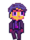

# Skybound

## A 2d platformer OOP game with:
- State management, different screens.
- Animations, sfxs.
- NPC monster with simple AI
- Infinite, random level creation.
- A shop, different characters
- A simple database for storing highscore, player selection, 
with homemade API functionality.
- 46 MB executable with pyinstaller instructions
- Documented according to PEP-8 (ish).

## Works on Windows, Mac, Linux, Android

## Missing functionality:
- Parallaxing background + Background shaders
- Pause screen: Clickable buttons, pause music functionality

## I took the background images from here
[Background images](https://craftpix.net/freebies/free-sky-with-clouds-background-pixel-art-set/)

## Build instructions for pyinstaller (only 46MB!):

1. Pip install Pyinstaller

2. Modify the Pyinstaller script for your Path

3. Run the script: 

pyinstaller --noconfirm --onefile --windowed --optimize "1" --icon "C:Path to game\icon.ico" --name "Skybound4" --add-data "C:Path to game\font;font/" --add-data "C:\Path to game\txts;txts/" --add-data "C:Path to game\imgs;imgs/" --add-data "C:Path to game\sfxs;sfxs/"  "C:Path to game\main.py"
